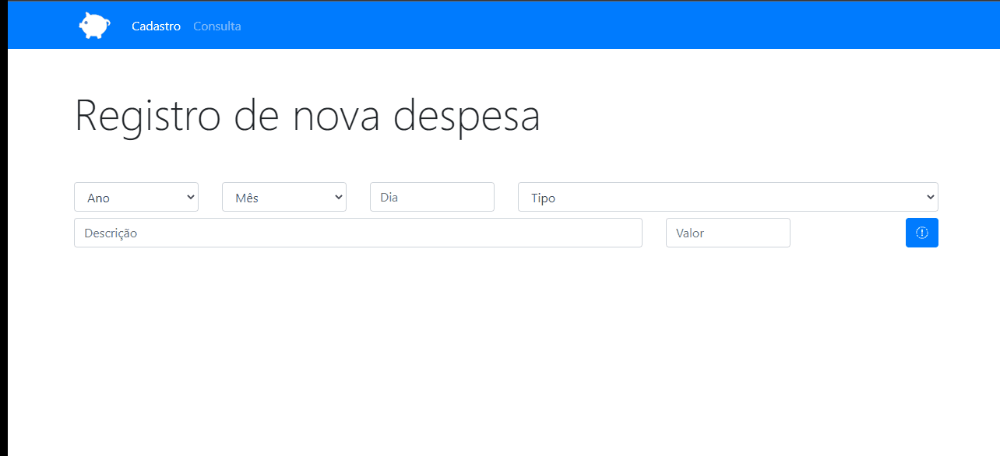
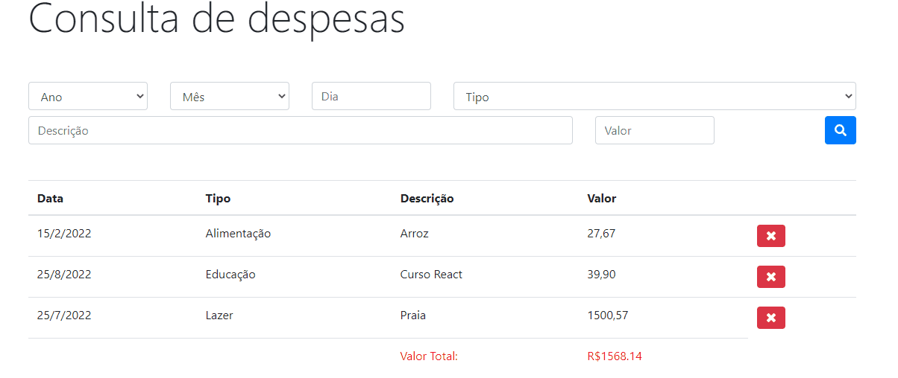

# Personal Budget 💸

It's a simple personal budget that I've learned in a JavaScript class.

## 🚀 Technologies
- HTML
- CSS
- Bootsrap v4.0.0

## ℹ Description/Important notes

<div>
  It was a class that I've learned about Bootstrap and localStorage in a course on the 'Udemy Courses', called "Desenvolvimento Web Completo 2022 - 20 cursos + 20 projetos"
  made by the developers and mentors: </br>
  - Jorge Sant Ana 🧙‍♂️ </br>
  - Jamilton Damasceno 🧙‍♂️</br>
  I totally recommend this course if you have pressed the button start 🎮 as I did recently to enter this programming world. Link below:
  <a href="https://www.udemy.com/course/web-completo/">https://www.udemy.com/course/web-completo/</a>
</div>
</br>

<h3>Look it working:</h3> 
</br>
  <h1>
    
  </h1>

### But what I could learn and put in practice here?
  In this class, the most important lesson was how to create and use a localStorage and make filters in a table using the data on localStorage. </br>
  The mentor didn't teach how to make a sum in the end of the table that shows all expenses you added. Now the sum appears there when you are consulting the expenses, because I created it. 
 </br>
  Look it better below: </br>
  
  <h1>
    
  </h1>
  
```javascritp
function sumExpenses(expenses) {
  
  let sum = 0;
  for(let i in expenses){
    const expenseWithDot = parseFloat(expenses[i].value.replace(/,/, '.'))
    sum += expenseWithDot
  }
  
  const tfoot = document.getElementById('tfoot');
  tfoot.style.color = 'red'
  const trInTfoot = document.querySelectorAll('#trTfoot')

  //adding the result on tfoot
  const row = tfoot.insertRow();
  row.setAttribute('id', 'trTfoot')

  if(trInTfoot.length >= 0 ){
    row.insertCell(0).innerHTML = '';
    row.insertCell(1).innerHTML = '';
    row.insertCell(2).innerHTML = `Valor Total:`;
    row.insertCell(3).innerHTML = `R$${sum.toFixed(2)}`;
    trInTfoot[0].remove()
  }
}
```

If you want to collaborate, to give some opinion, if you know a different way to do, or just want to make a new friend, than send me a e-mail or message on my LinkedIn:
 <a href = "mailto:lucas.virolli2@gmail.com"></a>
 <a href="https://www.linkedin.com/in/lucasvirollidalbello/" target="_blank"></a> 

##

Made with much 💜 by Lucas Virolli 🙋‍♂️
